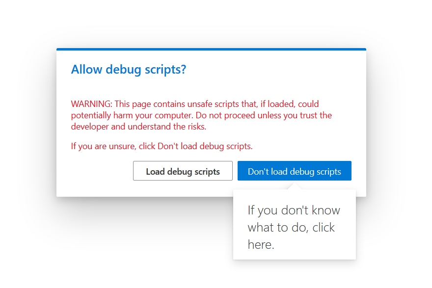
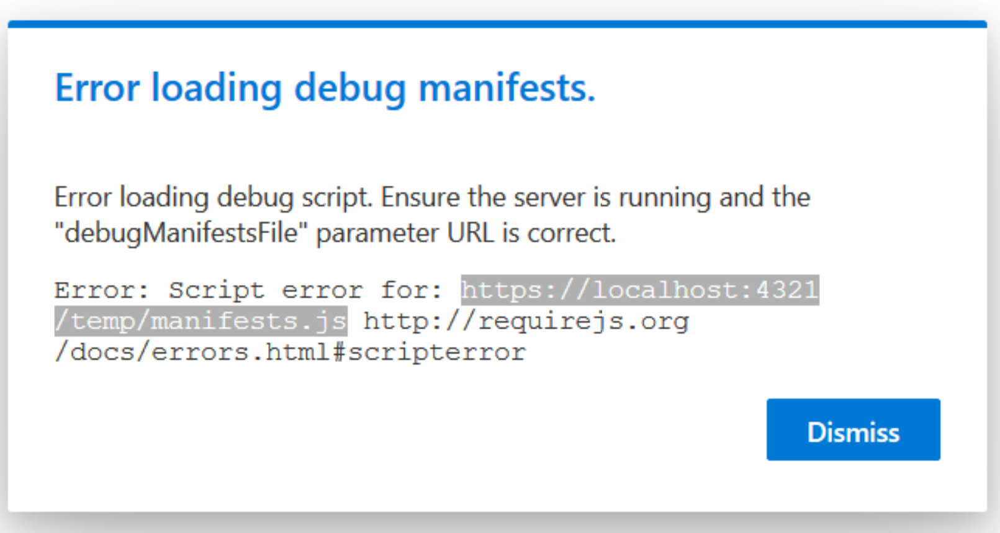
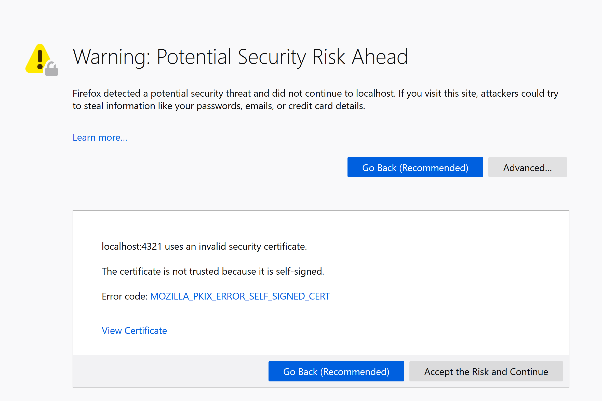

It is common practice to debug a SharePoint Framework solution using [Modern pages](https://docs.microsoft.com/en-us/sharepoint/dev/spfx/debug-modern-pages). 

I recently developed some SPFx solutions using a slightly different development setup as usual. Instead of using Edge or Chrome for debugging, I used the latest version of Mozilla Firefox.

Once I started my debugging session, I received a well-known error message after hitting the **Load debug scripts** operation.



```
Error loading debug manifest

Error loading debug script. Ensure the server is running and the "debugManifestFile" parameter URL is correct.
```



Usually, you get this error message if you do not serve your solution using the **gulp serve --nobrowser** command or if you forgot to trust the self-signed certificate using the **gulp trust-dev-cert** command. In my case, I was sure that both things happened.

After a while, I figured out that Mozilla Firefox was ignoring the trust performed by the **gulp trust-dev-cert** command. I had to navigate to the served URL *https://localhost:4321* directly using the browser.



From there, I manually accepted the risk and continued the navigation. Mozilla Firefox started trusting my self-signed certificate. Afterward, my SPFx solutions worked fine also with Mozilla Firefox.